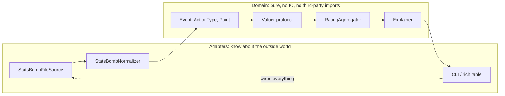

# Regista: Player Rating Engine — Build and Explain

## What we are building in this pass

One command, `regista rate --match 3773497`, that reads a real StatsBomb match off disk, normalizes every event into our own domain types, assigns a value to each action, rolls those into per-player ratings adjusted for minutes, and prints a provisional explanation per player. All five modules from your doc, each one real but only as deep as it needs to be.

The discipline is: build the whole skeleton before deepening any bone. A vertical slice tells you whether your *seams* are right, which is the thing that is expensive to change later. Weight tuning is cheap to change and can wait.

## The central design idea: dependency direction

The reason your doc says "the boundaries matter more than the internals" is a specific architectural claim, and it has a name: ports and adapters, sometimes called hexagonal architecture. The rule is that all dependencies point inward toward the domain, and the domain depends on nothing.



Concretely this means `src/regista/domain/` will have zero imports from anything outside the standard library, and the word "StatsBomb" will appear nowhere inside it. That single constraint is what makes the Phase 8 live-feed swap and the Phase 5 model swap cheap, and it is mechanically checkable — we will add a test that asserts it.

## Verified data facts to build on

I checked these against the live repository rather than assuming them:

- Coordinates are always in the acting team's own attacking frame: own goal at x=0, opponent goal at x=120, pitch 120 by 80. Evidence: goalkeeper events average x=3.1, clearances x=16.0, and shots average x=103.7 for Argentina and x=103.6 for France in the same match with no flip between first and second half. Conclusion: no per-team coordinate flipping is needed, and `distance_to_opponent_goal` is always measured from x=120.
- The 2021 Clásico (`3773497`) is the recommended primary fixture: clean lineups, no extra time, La Liga.
- The 2022 World Cup final (`3869685`) is the recommended *second* fixture precisely because it is broken: 4407 events, periods 3 through 5, and corrupt lineup position timestamps. It belongs in the test suite later as the case that proves minutes handling is robust.
- Event volume per match is roughly 3500-4500 events. That is small. It justifies plain Python objects for the whole first pass and defers every database and dataframe question.
- The two highest-count event types are `Pass` and `Ball Receipt*`. `Ball Receipt*` is largely redundant with the `pass.recipient` field, and dropping it is a defensible first decision that halves your event count.

## Technology choices, with the alternatives argued

- **Packaging: uv, not Poetry.** Your doc says Poetry, and Poetry would work. I recommend uv because it also manages the Python interpreter itself, so `uv python pin 3.13` pins the toolchain for you rather than depending on whatever `python3` resolves to. Right now `python3` on this machine is 3.11.5 from a framework install while Homebrew has 3.13, which is exactly the ambiguity uv removes. It reads standard `pyproject.toml`, so switching back to Poetry later is a metadata edit, not a migration.
- **Raw JSON loading, not `statsbombpy`.** Your doc leans this way for understanding, and I agree, but the architectural point is stronger: `statsbombpy` returns dataframes, which would make the provider's shape leak into our types. Loading raw and normalizing by hand keeps the anti-corruption layer honest. Because it sits behind a port, a `StatsBombPySource` adapter remains a drop-in option if the manual loader becomes tedious.
- **Frozen dataclasses, not pydantic, in the domain.** Pydantic validates at boundaries, which is genuinely useful, but a pydantic model in the domain couples your core to a third-party library and to its validation semantics. The boundary parsing we need is small enough to hand-write. If ingest validation grows painful, pydantic goes in the adapter only.
- **No pandas, and no Polars yet.** A dataframe is the right tool at season scale and the wrong tool for one match, because it destroys the type information we are about to carefully build. Plan: plain objects now, Parquet plus Polars or DuckDB when we cross a season in Phase 3, Postgres only when your doc's condition is met.
- **Testing: pytest, plus Hypothesis for the geometry.** Coordinate math has properties worth stating as invariants rather than examples, which is what property-based testing is for.
- **Tooling: ruff for lint and format, pyright for types.** Ruff replaces black, isort and flake8 in one binary. Pyright infers `Protocol` conformance more reliably than mypy, which matters because Protocols are the load-bearing abstraction here.
- **Output: rich.** The MVP deliverable is literally a terminal table, so a table library earns its place. `typer` for the CLI is optional sugar over `argparse`; I will start with `argparse` to keep the dependency count honest and revisit.
- **Deferred and flagged, not decided:** your doc names Spring Boot for Phase 6 while the engine is Python. That is a real cross-language decision (either FastAPI to stay in one language, or Spring Boot reading a shared Postgres or Parquet store). We should not resolve it now, but I will keep the aggregation output serializable so either path stays open.

## Repository layout

```
Regista/
  pyproject.toml            # uv, ruff, pytest, pyright config
  data/statsbomb/           # gitignored local cache of downloaded JSON
  src/regista/
    domain/                 # zero IO. no third-party imports. no "statsbomb".
      ids.py                # NewType wrappers: MatchId, PlayerId, TeamId
      geometry.py           # Point, Pitch, distance/angle to goal
      events.py             # ActionType, Outcome, Event
      valuation.py          # ValueBreakdown, ValuedEvent
      ratings.py            # Spell, PlayerMatchRating, PositionGroup
    ports.py                # Protocols: EventSource, Valuer, Aggregator, Explainer
    adapters/statsbomb/
      source.py             # FileSource, HttpSource, CachingSource
      taxonomy.py           # StatsBomb type ids -> our ActionType
      normalizer.py         # the anti-corruption layer
    valuation/
      weights.py            # the tunable table, as data
      heuristic.py          # HeuristicValuer
    aggregation/
      minutes.py            # spells and minutes from lineups
      aggregator.py
    explain/
      baseline.py           # WithinMatchBaseline now, SeasonBaseline later
      report.py             # template-driven text
    cli.py                  # the composition root: the only place that wires
  tests/
    unit/  fixtures/  contract/
```

## The eight increments

Each one lands as a commit, runs, and comes with a written explanation of the one concept it exists to teach.

**1. Setup and the composition root.** uv project, pinned 3.13, src layout, ruff, pytest, pyright, git init. Concept: why a `src/` layout prevents accidental imports of your uninstalled package, and what a composition root is — the single place where concrete classes get chosen, so that nothing else has to know them.

**2. Domain geometry.** `Point`, `Pitch`, distance and angle to the opponent goal. Concept: value objects versus entities. A `Point` has no identity and is compared by value, so it is frozen; a `Match` has identity and is not. Plus a data contract test that re-runs my orientation check against the real file, so if StatsBomb ever changes convention the suite tells you instead of the ratings quietly inverting.

**3. The `Event` type and `ActionType` enum.** Deliberately small enum per your doc. Concept: the tension between one wide optional-heavy record and a tagged union of per-action types. I will build the wide record first and explain exactly what it costs — `end_location` being `None` for a tackle is an illegal state your type system is not preventing — so that the later refactor is a decision rather than an accident.

**4. Ports.** `EventSource`, `Valuer`, `RatingAggregator`, `Explainer` as `Protocol`s. Concept: structural typing versus nominal, that is `Protocol` versus `ABC`. Protocols let an adapter satisfy the interface without importing it, which is what actually keeps the dependency arrows pointing inward. Also: why `Valuer.value` takes the whole sequence, as your doc correctly insists.

**5. StatsBomb adapters and the normalizer.** `FileSource` with an `HttpSource` fallback and a caching decorator. Concept: the anti-corruption layer from domain-driven design, and the Decorator pattern for caching without touching the loader. This is also where we confront the `raw` passthrough your doc wants: it is the right call, and it is a controlled leak, so I will explain how to keep it from becoming load-bearing.

**6. The heuristic valuer.** Base weights times location multiplier times outcome modifier. Concept: two things. First, Strategy — `HeuristicValuer` and the later gradient-boosted valuer are interchangeable behind one port, which is the open-closed principle doing actual work. Second, and more important: `value()` returns a `ValueBreakdown`, not a float. A float cannot be explained, and your Explain layer is a stated requirement, so the decomposition has to be captured at the moment of computation rather than reconstructed later. I will bring proposed numbers for every gap your doc left blank and argue each one, expecting you to disagree.

**7. Aggregation with minutes and spells.** Concept: time-varying attributes. Position is not a field on a player, it is a function of time, which the Clásico proves — Messi plays two positions and Griezmann three. So we model `Spell` objects with an interval, derive minutes from them, and resolve a primary position by occupancy for the rating table.

**8. Explanation, honestly stubbed, then the verification ritual.** A `WithinMatchBaseline` that ranks each player against same-position players in that one match. Concept: the Null Object and degenerate-implementation idea — the seam must exist and be exercised even though the answer is not yet trustworthy, and the output must label itself provisional. Then your doc's real test: print the ten highest and lowest valued actions and check them against memory of the match.

## Guardrails

I will stop and ask rather than guess if the valuation weights start needing soccer judgment I should not be making for you, if the top-ten-actions check comes out obviously wrong in a way that implicates the design rather than the constants, or if the honest fix for something is a refactor large enough to be its own decision.
